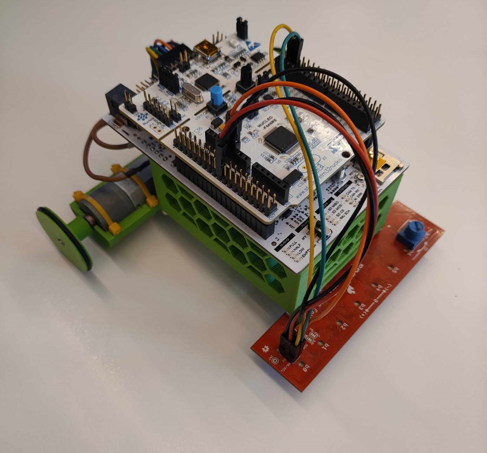

# PM2_Line_Follower_Example
The project involves the development of a differential robot equipped with a line follower sensor. This robot is designed to autonomously navigate along predefined paths by detecting and following lines on the ground. The incorporation of a line follower sensor enables the robot to make real-time adjustments in its movements, showcasing a practical application of robotics in path tracking and automated navigation.

## Hardware
Components and sensors employed in the design:
- Nucleo-F446RE with custom PES board
- 2 x 78:1 Metal Gearmotor 20Dx43L mm 12V CB
- SparkFun Line Follower Array
- 2 x Conrad energy NiMH receiver battery packs 6V, 2300mAh
- Jumper wires

Links to hardware

[Nucleo-F446RE][1]

[78:1 Metal Gearmotor 20Dx43L mm 12V CB][2] 

[SparkFun Line Follower Array][3]

[Conrad energy NiMH receiver battery packs 6V, 2300mAh][4]

## Prerequisites
- Mbed Studio
- Libraries:
    - mbed-os 6.17.0
    - eigen
    - pm2_drivers

In order to run the project you need to have Mbed Studio with which you can compile the ``main`` program and run it on the microcontroller. All the libraries you need are included in the repository. If you use a different design, kinematics, or hardware, you need to change the appropriate variables for the program to run properly. Also, if you are not using a custom PES Board, you need to change pins names that are passed as parameters while objects are defined.

## Comments
- The files include a map that should be printed on a large scale for the algorithm to run properly: [MAP](docs/Highspeed_2.pdf)

## Notes:
- Update dependencies after releasing drivers! 

<!-- link list, last updated 16.01.2024 -->
[1]: https://www.st.com/en/evaluation-tools/nucleo-f446re.html
[2]: https://www.pololu.com/product/3477
[3]: https://www.sparkfun.com/products/13582
[4]: https://www.galaxus.ch/en/s5/product/conrad-energy-nimh-receiver-battery-packs-mignon-6-v-2300-mah-rc-batteries-8432281

